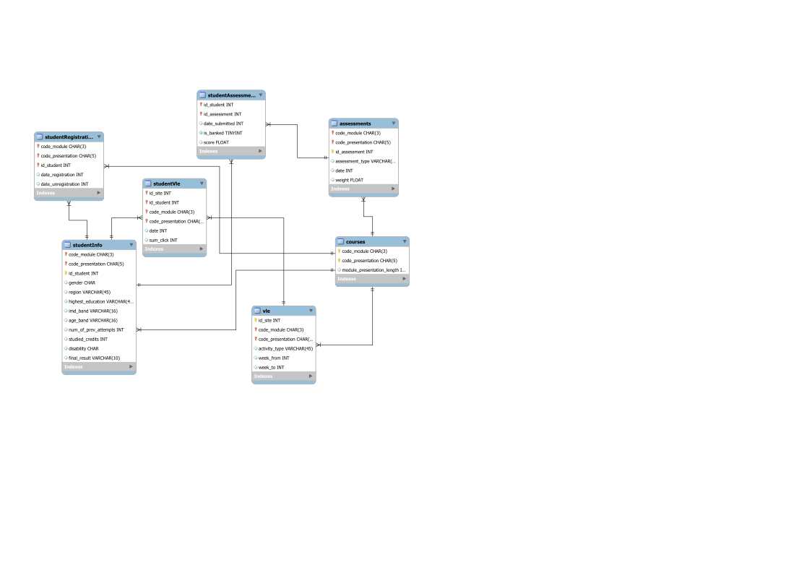

# OULAD-CASE


This is an implementation of EDA and ETL for [OULAD Dataset](https://analyse.kmi.open.ac.uk/#open-dataset).

The environment variables must be modified before running the app.

## Diagram


## Basic Structure of the project
```
oulad-case/                  # ── project root ────────────────────────────
└── .github/
    └── workflows/
        └── ci.yml              # lint → type-check → test → coverage
├── config/
│   ├── logging.yml             # PyYAML logging config
│   └── ddl/
│       └── 00_create_oulad.sql # CREATE TABLE … scripts
├── data/                       # ── datasets --------------------------------
│   ├── raw/                    # ZIP + extracted CSVs
│   └── processed/              # cleaned parquet, features, etc.
├── notebooks/                  # Jupyter EDA
│   └── 00_eda_overview.ipynb
├── resources/                  # README resources
│   └── diagram.svg
├── src/oulad_etl/              # ── importable package ----------------------
│   ├── __init__.py
│   ├── settings.py             # env handling (pydantic)
│   ├── log.py                  # loads YAML + sets root logger
│   ├── etl/
│   │   ├── ddl_loader.py       # run *.sql files against MySQL
│   │   ├── download.py         # fetch + unzip
│   │   └── load.py             # bulk-insert via SQLAlchemy or MySQL cursor
│   │   └── models.py             # enums of columns of each model
│   │   ├── transform.py        # tidy up (pandas)
│   └── cli.py                  # `poetry run oulad-etl …`
├── tests/
│   └── unit/
│       └── test_dummy.py
├── .env.example                # DB creds template (see below)
├── .gitignore
├── .pre-commit-config.yaml
├── pyproject.toml              # Poetry deps & tooling
├── README.md
```
## Quick start

### Boostrap the app
```bash
git clone <repo-url>
cd oulad-case
cp .env.example .env          # customise creds
poetry install
pre-commit install
poetry run ipython kernel install --user --name eda_overview
```

### Run the ETL and EDA pipeline
```bash
poetry run etl run
poetry run jupyter lab --notebook-dir notebooks
```

## References

